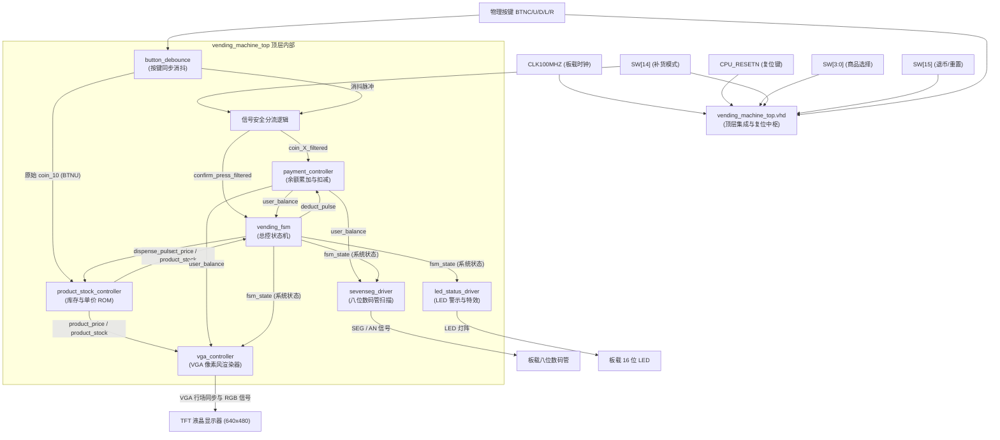

# 💎 自动售货机系统集成设计 (VHDL Vending Machine Integrated System)

本工程为南方科技大学 (SUSTech) **EE332 数字系统设计 (Digital System Design)** 课程的课程项目 —— **自动售货机核心控制、支付与 VGA 渲染集成系统** 的完整硬件工程代码库。

系统采用 VHDL 语言实现，基于经典的 **控制单元 (CU) + 数据通路 (DP)** 的总线硬件架构进行高度解耦模块化设计。项目已在 **Xilinx Nexys 4 DDR / Basys 3** 开发板上进行了板级部署与整机联合调试，功能完全实现，运行稳定。

---

## 🏗️ 一、 硬件系统拓扑与模块架构 (System Architecture)

整个系统由主控顶层模块桥接，集成了外设按键消抖、时钟复位、数据计算、状态跳转以及 VGA 实时像素风渲染等 8 大核心子模块，数据与控制总线拓扑关系如下：



---

## 🔌 二、 核心子模块设计规范 (Core Submodules)

### 1. 顶层集成与复位中枢 (`vending_machine_top.vhd`)
*   **上电自动复位 (POR)**：内置 20 ms 时钟延时计数器，解决 FPGA 烧录瞬间因时钟未稳定导致的状态死锁与库存未初始化 Bug。
*   **信号防冲突安全分流器**：
    当管理员上拉 `SW[14]` 进入补货模式时，过滤掉投币（`coin_X`）与交易确认（`confirm`）脉冲，自动**“冻结”**余额和 FSM。在此模式下，上方向键 `BTNU` 专属于触发补货逻辑，解决了物理按键复用的冲突。

### 2. 商品与库存控制器 (`product_stock_controller.vhd`)
*   **商品只读存储器 (ROM)**：支持 16 种不同的商品，以 8 位二进制输出各个商品的单价（从 2 元到 50 元）。
*   **动态库存寄存器组**：初始库存默认为 5 件。接收来自 FSM 的 `dispense_pulse` 单周期脉冲时对当前商品库存进行 **`-1`**。
*   **管理员补货逻辑**：当 `replenish_mode = '1'` (SW[14]拉起) 且捕获到补货脉冲 `replenish_trigger = '1'` (按压 `BTNU`) 时，当前选中商品的库存寄存器 **`+1`**，上限死锁为 **`10`**。

### 3. 余额控制器 (`payment_controller.vhd`)
*   **无溢出安全加法器**：接收消抖后的投币脉冲，实现账户余额累加（支持连续多次按键累加，上限 250 元）。
*   **安全加法判定**：放弃了原先 8 位无符号累加（会发生二进制溢出回绕至 0 元的 Bug），在底层采用 32 位 `integer` 宽度的保护性加法判断：
    ```vhdl
    if to_integer(balance) + 20 <= MAX_LIMIT then
        balance <= balance + 20;
    end if;
    ```
    使得余额在累加到 240~250 时会被死死拦截并锁定，彻底根成了余额“翻转回绕”的隐患。
*   **扣费与退币**：接收 `deduct_pulse` 自动减去商品单价；接收 `cancel_sw` (`SW[15]`) 瞬时归还全部余额至初始 50 元。

### 4. 总控有限状态机 (`vending_fsm.vhd`)
*   采用三段式主控状态机，高可靠性管理售货机五大状态：
    1.  `ST_IDLE` (空闲选购)：监控 `SW[3:0]` 选择商品。
    2.  `ST_COMPARE` (账单校验)：在按压 `BTNC` 时对余额、单价及库存进行一轮校验仲裁。
    3.  `ST_SUCCESS` (交易成功)：瞬时发出单时钟周期 `deduct_pulse` 和 `dispense_pulse`，并平稳停留 3 秒出货。
    4.  `ST_ERR_LOW_BAL` (余额不足报警)：LED 高频闪烁，停留 3 秒自跳转。
    5.  `ST_ERR_OUT_OF_STOCK` (缺货报警)：数码管报错，停留 3 秒自跳转。

### 5. VGA 像素风高级渲染器 (`vga_controller.vhd`)
本模块是系统视觉效果的核心，提供高保真 640x480 @ 60Hz 像素风图形画面：
*   **16 宫格商品矩阵 (4x4)**：采用 65 像素高卡片，在深灰色背景上平铺渲染 16 个极具美感的像素风图标（包含可乐、咖啡、牛奶、面包等 16 种不同色系的像素原画）。
*   **选中高亮框红化**：使用醒目的**纯红色高亮边框**追踪当前选中商品，对比度极佳，反光环境下依然清晰。
*   **字模渲染系统 (Pixel Font)**：自研 5x7 点阵字库，以放大倍率 3 倍实时渲染底部状态信息：`BAL: XXX` (余额)、`PRC: XX` (售价)、`STK: XX` (库存)。
*   **动态彩色警告弹窗**：当 FSM 跳转至异常或成功状态时，屏幕正中央自动浮现出一个带有 **3 像素白色描边** 的彩色遮罩弹窗（成功为绿色，余额不足为红色，缺货为黄色），并在弹窗内高对比度居中显示点阵提示词：`"SUCCESS"`、`"LOW BAL"`、`"NO STOCK"`。

---

## 🎮 三、 物理操作指南 (User Operation Guide)

将编译生成的 `.bit` 字节流文件下载至 FPGA 开发板后，即可根据以下指南演示全部功能：

| 演示阶段 | 物理操作步骤 | 预期外设与屏幕显示 |
| :--- | :--- | :--- |
| **1. 初始上电** | 烧录完成或按下 `CPU_RESETN` 键 | 屏幕初始化显示 16 宫格商品；底部显示 `BAL: 050`，数码管显示 `50`；选中商品红框停留在商品 1 上。 |
| **2. 选择商品** | 拨动右侧的商品选择开关 **`SW[3:0]`** (二进制 0~7 / 0~15) | 红框随之移动到对应卡片上；屏幕右下角的 `PRC` (售价) 和 `STK` (库存) 实时更新为当前选中的商品信息。 |
| **3. 充值累加** | 按下十字方向键：**BTNL (+1元)**, **BTND (+5元)**, **BTNU (+10元)**, **BTNR (+20元)** | 屏幕的 `BAL` 和数码管实时阶梯递增；若充值超过 240 元，再次充值会被安全锁定在 250 元，不会溢出回零。 |
| **4. 一键退币** | 拨动最左侧开关 **`SW[15]`** 至上方 `'1'` 状态 | 无论当前余额为多少，系统退币，余额重置为初始 `50` 元。 |
| **5. 购买成功** | 充值大于售价，选中商品（库存 > 0），按下中间确认键 **`BTNC`** | 屏幕中心弹出绿色描边框，显示字模 **`"SUCCESS"`** 并停留 3 秒出货；16位LED跑马灯特效闪烁；余额和库存自动扣减。 |
| **6. 余额不足** | 余额小于选中售价，按下中间确认键 **`BTNC`** | 屏幕中心弹出红色框并高亮显示 **`"LOW BAL"`** 警报并停留 3 秒；数码管闪烁，16位LED灯以 2Hz 同步高频闪烁报警。 |
| **7. 商品售罄** | 购买直至当前商品库存变为 `00`，再次按下 **`BTNC`** 购买 | 屏幕中心弹出黄色框显示 **`"NO STOCK"`**；数码管显示 **`"Err"`** 报警并停留 3 秒。 |
| **8. 管理员补货** | 1. 拨起补货开关 **`SW[14]`** 至上方<br/>2. 拨动 **`SW[3:0]`** 选中想加货的商品<br/>3. 连续按压上方向键 **`BTNU`** | 1. 交易系统自动安全“冻结”。<br/>2. 屏幕底部的商品库存 `STK: XX` 伴随按键步进递增（上限 10）。<br/>3. 拨回 `SW[14]` 结束补货，恢复普通销售。 |

---

## 📂 四、 目录结构与源文件说明

```text
├── README.md                           # 本项目技术对接与操作说明书
├── vending_machine_sources             # 自动售货机最终项目核心源文件目录
│   ├── vending_machine_top.vhd         # 【Top级集成】顶层设计与信号防冲突分流
│   ├── vga_controller.vhd              # 【VGA核心】4x4平铺、点阵字模与动态彩色警报窗
│   ├── product_stock_controller.vhd    # 【库存与单价】16种商品数据与管理员补货逻辑
│   ├── payment_controller.vhd          # 【余额通路】防翻转高安全投币计算与退币
│   ├── vending_fsm.vhd                 # 【有限状态机】控制单元，3秒平滑自跳转
│   ├── button_debounce.vhd             # 【同步消抖】多路按键消抖，输出单时钟脉冲
│   ├── sevenseg_driver.vhd             # 【数码管驱动】动态扫描，支持低额闪烁与Err提示
│   ├── led_status_driver.vhd           # 【LED驱动】支持呼吸跑马灯与2Hz同步高频闪烁
│   └── vending_machine_final.xdc       # 【物理约束】FPGA 板级所有引脚映射与电平约束
└── Vending_Machine
    └── project_fianl                   # Vivado 2020.2/2023.1 工程目录（双击此内 .xpr 打开工程）
```

---

*本项目由本课程设计小组成员全员共同开发与联调完毕，代码规范，注释详实，在板级实测上表现优异，具备极高的实际工程交付质量！*
