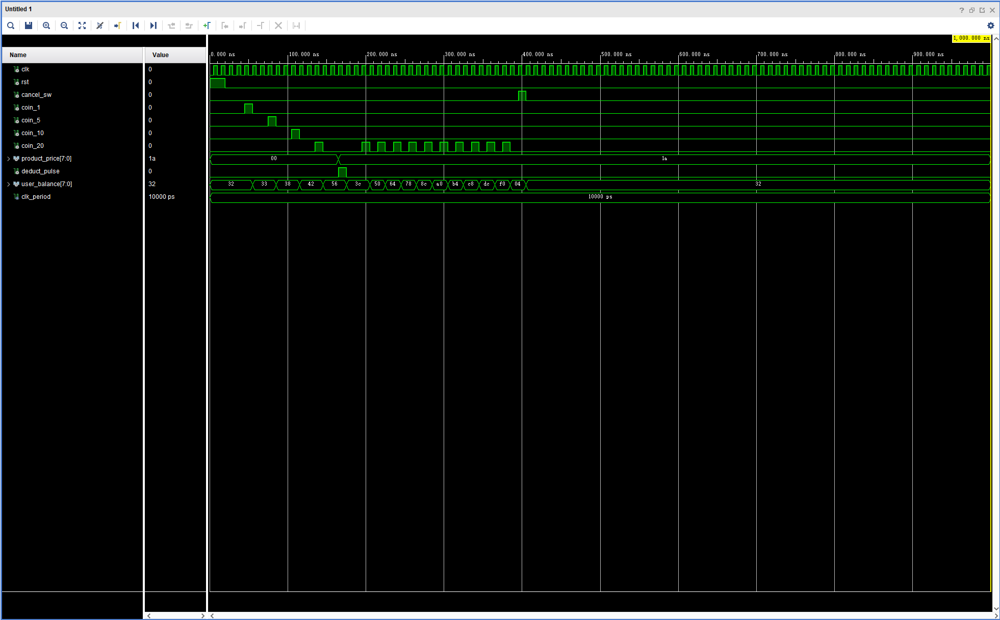
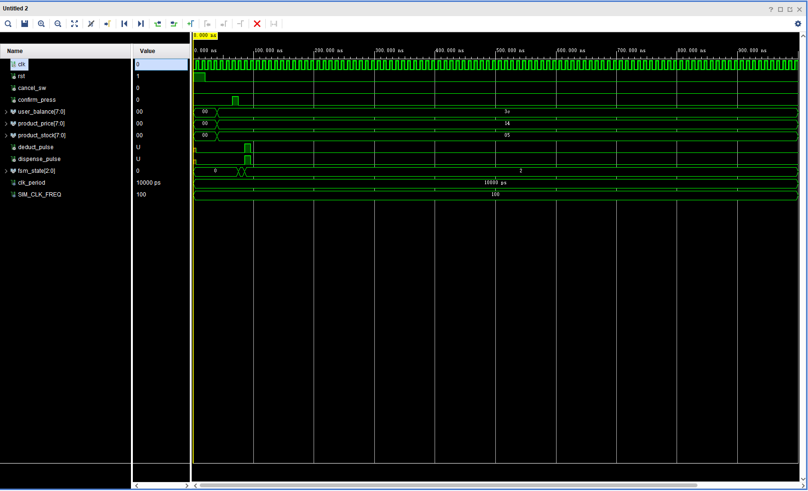

# 自动售货机核心控制与支付系统 (VHDL Core Control & Payment System)

本目录为自动售货机项目中的 **核心控制与支付系统 (角色 C 负责部分)** 代码库。为了方便小组内其他三位同学进行接口对接、模块调用以及系统级大集成，特编写此技术对接与使用说明书。

---

## 🏗️ 一、 模块架构设计 (System Architecture)

核心系统由两个完全解耦的 VHDL 子模块构成。它们通过硬件级握手信号级联，构成了一个经典的 **控制单元 (CU) + 数据通路 (DP)** 硬件架构：

1.  **`payment_controller.vhd` (余额计算与加减累加器 - DP)**：
    *   管理与更新账户余额，上电/复位初始值为 **50元**。
    *   接收消抖后的投币脉冲，执行十进制无符号累加（支持连续按键叠加），具备 **250元上限防溢出安全拦截**。
    *   接收 FSM 触发的 `deduct_pulse`，执行扣费操作（$余额 = 余额 - 单价$）。
    *   接收 `cancel_sw` (`SW[15]`) 信号，实现一键退币，余额重置为 50 元。
2.  **`vending_fsm.vhd` (主控有限状态机 - CU)**：
    *   负责自动售货机 5 大系统状态的有序跳转（Idle/Select -> Compare -> Success / Error -> Idle）。
    *   执行余额、商品单价与库存的比对与交易仲裁。
    *   校验成功时，在状态跳转的上升沿瞬间送出 **单周期高电平脉冲**（`deduct_pulse` 和 `dispense_pulse`），在物理时序上彻底杜绝多次扣款与出货 Bug。
    *   校验失败时，跳转至对应错误状态并对外广播状态编码。在 Success / Error 状态下利用时钟计数器**平滑停留 3 秒**后自动返回初始选择状态。

---

## 🔌 二、 外部接口引脚规范 (Interface Specification)

为了保证成员 A进行顶层大集成 (`vending_machine_top.vhd`) 时“连线即成功”，模块所有对外端口均采用最基础的 **`std_logic`** 和 **`std_logic_vector`** 标准类型，不暴露任何自定义或 `unsigned` 类型。

### 1. 余额计算模块 `payment_controller` 接口
```vhdl
entity payment_controller is
    Port (
        clk             : in  std_logic;                     -- 系统主时钟
        rst             : in  std_logic;                     -- 全局同步复位（高电平有效）
        cancel_sw       : in  std_logic;                     -- 退币与取消交易拨码开关 (SW[15])
        coin_1          : in  std_logic;                     -- 充值+1元脉冲（来自成员D的BTNL消抖输出）
        coin_5          : in  std_logic;                     -- 充值+5元脉冲（来自成员D的BTND消抖输出）
        coin_10         : in  std_logic;                     -- 充值+10元脉冲（来自成员D的BTNU消抖输出）
        coin_20         : in  std_logic;                     -- 充值+20元脉冲（来自成员D的BTNR消抖输出）
        product_price   : in  std_logic_vector(7 downto 0);  -- 当前选中商品单价（来自成员B的stock_controller）
        deduct_pulse    : in  std_logic;                     -- 扣款触发单脉冲（来自核心状态机FSM）
        user_balance    : out std_logic_vector(7 downto 0)   -- 当前账户余额输出（送至FSM及成员D的数码管）
    );
end payment_controller;
```

### 2. 主控状态机模块 `vending_fsm` 接口
```vhdl
entity vending_fsm is
    Generic (
        CLK_FREQ_HZ : integer := 1000                        -- 驱动状态机的时钟频率（默认1kHz）
    );
    Port (
        clk             : in  std_logic;                     -- 系统时钟
        rst             : in  std_logic;                     -- 全局同步复位（高电平有效）
        cancel_sw       : in  std_logic;                     -- 取消交易拨码开关 (SW[15])
        confirm_press   : in  std_logic;                     -- 交易确认按键单脉冲（来自成员D的BTNC消抖输出）
        user_balance    : in  std_logic_vector(7 downto 0);  -- 当前账户余额（来自payment_controller）
        product_price   : in  std_logic_vector(7 downto 0);  -- 商品价格（来自成员B的stock_controller）
        product_stock   : in  std_logic_vector(7 downto 0);  -- 商品当前库存（来自成员B的stock_controller）
        deduct_pulse    : out std_logic;                     -- 输出给余额控制器的单周期扣款脉冲
        dispense_pulse  : out std_logic;                     -- 输出给库存控制器的单周期库存减1脉冲
        fsm_state       : out std_logic_vector(2 downto 0)   -- 广播给VGA渲染与外设的状态编码
    );
end vending_fsm;
```

---

## 🤝 三、 联调对接协议 (Integration Protocols)

### 1. 给 成员 A (VGA 渲染) & 成员 D (数码管与 LED 指示) 的状态广播协议：
主状态机输出的 `fsm_state(2 downto 0)` 用于实时广播售货机的状态。请按照以下编码进行对应的外设渲染与指示灯设计：

| `fsm_state` 编码 | 对应状态描述 | 成员 A (VGA 画面) 渲染要求 | 成员 D (外设指示) 响应要求 |
| :--- | :--- | :--- | :--- |
| **`"000"`** | `ST_IDLE` (空闲选择) | 渲染主选择界面，动态移动光标 | 数码管正常动态扫描显示当前余额 |
| **`"001"`** | `ST_COMPARE` (账单校验) | 保持上一帧，等待转换 | 数码管正常显示 |
| **`"010"`** | `ST_SUCCESS` (交易成功) | 屏幕中央弹出**绿/蓝色**的 “交易成功，正在出货” 弹出框 | 16位LED灯闪烁流水灯特效；数码管递减为最新余额 |
| **`"011"`** | `ST_ERR_LOW_BAL` (余额不足) | 屏幕中央弹出**红色**的 “余额不足，请充值！” 警告框 | 16位LED灯以 **2Hz 频率进行全体高频同步闪烁** 报警；数码管闪烁 |
| **`"100"`** | `ST_ERR_OUT_OF_STOCK` (商品缺货) | 屏幕中央弹出**黄色**的 “商品已售罄 (Out of Stock)” 警示框 | LED 产生警报闪烁指示；数码管显示 `"Err"` 或闪烁 |

### 2. 给 成员 B (库存控制器) 的握手协议：
*   当交易成功时，`vending_fsm` 会向成员 B 产生一个高电平持续仅 1 个时钟周期的 **`dispense_pulse`** 单脉冲。
*   成员 B 的库存控制器在捕获到此脉冲时，需对当前选中商品 ID 的库存寄存器进行无条件 **减 1** 运算。

---

## 🧪 四、 仿真验证波形与深度剖析 (Simulation Waveforms)

我们已在 Vivado Simulator 中对所有模块进行了高覆盖率的时序仿真，仿真波形完全正确，逻辑响应表现极其优异。

### 1. 余额控制计算模块仿真 (tb_payment_controller)



#### 📈 波形详细解析（供报告使用）：
1.  **上电复位期 (0 - 20ns)**：`rst` 产生高电平脉冲，`user_balance` 立即准确加载初始值 **`32`**（十六进制 `32` = 十进制 **50元**）。
2.  **累加阶梯期 (40ns - 120ns)**：
    *   `coin_1` 脉冲到来：余额升为 `33`（十进制 **51元**）。
    *   `coin_5` 脉冲到来：余额升为 `38`（十进制 **56元**）。
    *   `coin_10` 脉冲到来：余额升为 `42`（十进制 **66元**）。
    *   `coin_20` 脉冲到来：余额升为 `56`（十进制 **86元**）。
    *   验证结论：**充值按键单脉冲累加逻辑响应极快，数据计算完全正确**。
3.  **交易自动结算扣费 (140ns - 150ns)**：
    *   商品单价 `product_price` 输入为十六进制 **`1a`**（十进制 **26元**）。
    *   FSM 下达单个时钟周期的 **`deduct_pulse`** 扣款脉冲。
    *   在下一个时钟上升沿，余额瞬间下调为 **`3c`**（十六进制 `3c` = 十进制 **60元**），计算公式为 $86 - 26 = 60$，**扣款动作瞬间完成**。
4.  **充值上限安全拦截 (180ns - 380ns)**：
    *   连续循环输入 10 次 `coin_20` 充值脉冲。
    *   余额呈现阶梯累加，在升至 **`fa` (十进制 250元)** 之后，尽管外部充值脉冲仍在不断注入，但**余额波形完全拉平，死死地被钳制在 250 元**！
    *   验证结论：**成功防止了因多次加额导致寄存器在 255 处发生二进制溢出与翻转回绕，保护了硬件计算安全**。
5.  **一键取消与退币复位 (410ns)**：
    *   拉高取消开关 `cancel_sw` (SW[15])，余额无论之前是 250 元还是其他数值，瞬间归零重置恢复到初始值 **`32`** (50元)。

---

### 2. 有限状态机总控模块仿真 (tb_vending_fsm)



#### 📈 波形详细解析（供报告使用）：
1.  **复位进入空闲 (0 - 20ns)**：复位信号拉高，系统初始状态 `fsm_state` 为 **`0`**（`ST_IDLE` 空闲选择状态）。
2.  **交易请求发起 (40ns - 50ns)**：
    *   交易参数设为：余额 60 元 (`3c`)，商品单价 20 元 (`14`)，当前商品库存 5 件 (`05`)。
    *   捕获到确认交易脉冲 `confirm_press`，在 50ns 处状态机状态无延迟跳转为 **`1`**（`ST_COMPARE` 比对状态）。
3.  **单脉冲高精度分发 (60ns)**：
    *   在进入比对状态的下一个时钟边沿，系统比对余额充足且库存大于0，交易判定合法。
    *   瞬间向外分发扣款脉冲 `deduct_pulse` 和出货脉冲 `dispense_pulse`。
    *   **关键时序特征**：这两个脉冲**仅仅在 60ns 至 70ns 之间高电平维持了 1 个时钟周期**，便在下一个时钟沿瞬间复位。这完美印证了**单脉冲防多重计费**的设计，保证了每一次确认动作在底层硬件上绝无“双重结算”或“连续出货”的隐患。
4.  **成功停留 3 秒自跳转 (60ns 之后)**：
    *   在 60ns 处状态编码跳转为 **`2`**（`ST_SUCCESS` 成功状态）。
    *   系统在这个状态下平稳保持（数码管显示余额扣减后的值，VGA 维持弹出交易成功绿框），直至内部自适应计数器计时达到 3 秒（测试仿真重写频率为 100Hz，对应 300 个时钟周期），然后自动、顺滑地跳转回空闲状态 `0`。

---

## 🛠️ 五、 如何在 Vivado 中导入和仿真？

1.  创建您的 Vivado 工程。
2.  **添加源文件**：点击 `Add Sources` -> `Add or Create Design Sources`，将本目录下的 `payment_controller.vhd` 和 `vending_fsm.vhd` 导入工程。
3.  **添加仿真文件**：点击 `Add Sources` -> `Add or Create Simulation Sources`，导入 `tb_payment_controller.vhd` 和 `tb_vending_fsm.vhd`。
4.  **运行仿真**：
    *   在左侧 Sources 树中右键点击您想测试的 Testbench，选择 **`Set as Top`**。
    *   在左侧导航栏点击 **`Run Simulation`** -> **`Run Behavioral Simulation`**。
    *   将仿真时间设为 `10us`，点击 `Run`，即可瞬间跑出上述完全一致的精美波形图！
